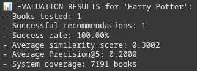

# Laporan Proyek Machine Learning - Firman Fitrah Ramadhan

## Project Overview

Di era digital saat ini, kita dihadapkan pada fenomena kelebihan informasi (information overload), di mana jumlah pilihan yang tersedia seringkali melebihi kemampuan kita untuk memprosesnya. Hal ini sangat terasa dalam dunia literasi; platform seperti Amazon, Goodreads, atau perpustakaan digital menyediakan akses ke jutaan judul buku, yang membuat pembaca kesulitan untuk menemukan bacaan baru yang sesuai dengan selera mereka (Adomavicius & Tuzhilin, 2005). Tanpa panduan yang efektif, pengguna dapat merasa frustrasi dan lelah dalam mengambil keputusan (decision fatigue), yang pada akhirnya mengurangi minat baca dan interaksi dengan platform.

Masalah ini perlu diselesaikan tidak hanya untuk meningkatkan pengalaman pengguna, tetapi juga dari perspektif bisnis. Platform digital bergantung pada keterlibatan pengguna (user engagement) untuk mendorong penjualan, langganan, atau pendapatan iklan. Dengan menyediakan rekomendasi yang relevan dan dipersonalisasi, platform dapat secara proaktif memandu pengguna menuju konten yang mereka sukai, sehingga meningkatkan kepuasan, loyalitas, dan nilai komersial.

Proyek ini bertujuan untuk membangun sebuah sistem rekomendasi buku dengan menggunakan pendekatan Content-Based Filtering. Sistem ini akan merekomendasikan buku kepada pengguna berdasarkan kemiripan atribut atau metadata (seperti penulis, penerbit, dan dekade terbit) dari buku yang pernah mereka sukai sebelumnya. Dengan demikian, sistem dapat membantu pengguna menjelajahi katalog yang luas dan menemukan "permata tersembunyi" yang sesuai dengan preferensi unik mereka.

**Referensi**:
- Adomavicius, G., & Tuzhilin, A. (2005). Toward the next generation of recommender systems: A survey of the state-of-the-art and possible extensions. IEEE Transactions on Knowledge and Data Engineering, 17(6), 734–749. [IEEE](https://doi.org/10.1109/TKDE.2005.99)

## Business Understanding

### Problem Statements

Menjelaskan pernyataan masalah:
- Dari jutaan judul yang tersedia, pengguna seringkali tidak tahu harus mulai dari mana. Proses pencarian manual yang tidak efektif dapat menyebabkan pengguna meninggalkan platform sebelum menemukan buku yang menarik minat mereka.
- Tanpa mekanisme untuk menyajikan konten yang relevan, platform berisiko kehilangan perhatian pengguna. Hal ini berdampak langsung pada metrik bisnis seperti waktu yang dihabiskan di platform (session duration), jumlah item yang dilihat, dan tingkat konversi penjualan.

### Goals

Menjelaskan tujuan proyek yang menjawab pernyataan masalah:
- Membangun sebuah model yang dapat menyarankan buku-buku yang kemungkinan besar akan disukai pengguna, berdasarkan karakteristik buku yang mereka minati.
- Dengan mempermudah proses penemuan buku, tujuan akhirnya adalah untuk meningkatkan durasi kunjungan pengguna, mendorong lebih banyak interaksi (seperti membaca ulasan atau membeli buku), dan membangun loyalitas pelanggan.

## Data Understanding
Dataset yang digunakan adalah "Book-Recommendation-Dataset" yang tersedia di platform Kaggle. Dataset ini terdiri dari tiga file CSV terpisah: Books, Users, dan Ratings. Dataset ini awalnya dikumpulkan oleh Cai-Nicolas Ziegler dari komunitas Book-Crossing dan berisi data 278,858 users (anonymized) berisi 1,149,780 ratings (eksplisit / implisit) dari 271,379 buku. Contoh: [Kaggle](https://www.kaggle.com/datasets/arashnic/book-recommendation-dataset).

- ### Dataset Books
    - **ISBN**: International Standard Book Number, kode unik buku.
    - **Book-Title**: Judul lengkap buku.
    - **Book-Author**: Nama penulis.
    - **Year-Of-Publication**: Tahun penerbitan buku.
    - **Publisher**: Nama perusahaan penerbit.
    - **Image-URL-S**: URL ke gambar sampul ukuran kecil (small).
    - **Image-URL-M**: URL ke gambar sampul ukuran sedang (medium).
    - **Image-URL-L**: URL ke gambar sampul ukuran besar (large).
    
Dataset books menyimpan metadata tentang buku, seperti ISBN, judul, penulis, tahun terbit, penerbit, dan tautan gambar sampul dalam berbagai ukuran. Dari total 271.360 entri, tidak ditemukan baris duplikat, namun terdapat nilai yang hilang pada kolom Book-Author, Publisher, dan Image-URL-L. Terdapat sejumlah nilai hilang di kolom penting seperti: Book-Author (2 data hilang), Publisher (2 data hilang), Image-URL-L (3 data hilang). Missing value tersebut ditangani dengan mengisi value yang kosong menjadi 'Unknown Author' dan 'Unknown Publisher'.

- ### Dataset Users
    - **User-ID**: ID unik pengguna.
    - **Location**: Lokasi pengguna.
    - **Age**: Usia pengguna.

Dataset users mencakup informasi pengguna seperti ID, lokasi, dan usia. Dari 278.858 pengguna, lebih dari 110 ribu tidak memiliki data usia. Selain itu, terdapat outlier nilai ekstrem seperti usia 0 atau 244 tahun, tetapi dapat diabaikan karena sistem ini menggunakann Content-Based-Filtering dan dataset user tidak digunakan.

- ### Dataset Ratings
    - **User-ID**: ID unik pengguna.
    - **ISBN**: ISBN buku yang diberi rating.
    - **Book-Rating**: Nilai rating dari 1-10 (eksplisit) atau 0 (implisit).

Dataset ratings berisi interaksi pengguna dengan buku dalam bentuk skor dari 0 hingga 10. Terdapat lebih dari 1,1 juta rating, di mana sebagian besar (lebih dari 700 ribu) memiliki nilai 0. Dalam konteks sistem rekomendasi, skor 0 umumnya dianggap sebagai implicit feedback—artinya pengguna mungkin telah melihat buku tetapi tidak benar-benar memberi penilaian. 

- Missing Value : Terdapat nilai yang hilang pada beberapa kolom krusial. Pada Books.csv, kolom Book-Author memiliki 1 nilai hilang, Publisher memiliki 2 nilai hilang, dan Image-URL-M memiliki 3 nilai hilang.

- Duplikasi Data : Tidak ditemukan adanya duplikasi data pada dataset.

- Outlier pada Data : Terdapat 1084 outlier dalam kolom usia. Outlier tersebut tidak perlu ditangani karena dalam hal ini kolom usia tidak digunakan sama sekali. Teradapat juga 57871 outlier pada kolom rating buku. Outlier ini juga tidak perlu diatasi karena mereka adalah buku yang sangat populer. Menghapus buku-buku ini dari dataset akan menghilangkan item-item penting dari katalog.

## Data Preparation
Proses persiapan data sangat penting untuk memastikan model menerima data yang berkualitas. Berikut adalah tahapan yang dilakukan secara berurutan:

- Penanganan Nilai Hilang (Missing Values): Kolom Book-Author dan Publisher yang kosong diisi dengan string 'Unknown'. Alasan: Ini dilakukan untuk mencegah error saat pemrosesan teks dan untuk mempertahankan data lain dalam baris yang sama yang mungkin masih berguna.
- Konversi Tipe Data dan Validasi: Kolom Year-Of-Publication dikonversi menjadi tipe numerik menggunakan pd.to_numeric dengan errors='coerce' untuk mengubah nilai non-numerik menjadi NaN, yang kemudian diisi. Data juga difilter untuk hanya menggunakan tahun yang valid (1900-2024).
- Agregasi Data Rating: Data ratings dan books digabungkan. Kemudian, rating_count (jumlah rating) dan avg_rating (rata-rata rating) dihitung untuk setiap buku. Hanya buku dengan rating_count 20 atau lebih yang dipertahankan. Alasan: Ini adalah langkah krusial untuk mengurangi noise dan memastikan model hanya belajar dari buku-buku dengan sinyal data yang cukup kuat, sehingga meningkatkan keandalan rekomendasi.
- Feature Extraction dengan TF-IDF: Tahap ini mengubah data teks mentah menjadi representasi numerik yang dapat dipahami oleh model.
    - Sebuah fitur gabungan content_features dibuat dengan menggabungkan teks dari Book-Author, Publisher, dan decade.
    - TfidfVectorizer dari Scikit-learn digunakan pada content_features. Proses ini menghasilkan matriks TF-IDF, di mana setiap buku direpresentasikan sebagai vektor     
      numerik yang mencerminkan pentingnya kata-kata dalam kontennya. 
    - Alasan: TF-IDF adalah teknik standar industri untuk feature extraction pada data teks. Ini memungkinkan kita untuk secara matematis menghitung kemiripan antar buku 
      berdasarkan konten tekstualnya.
- Reset Index: Setelah semua proses filtering, index dari DataFrame books_final di-reset menggunakan reset_index(drop=True). Alasan: Ini memastikan bahwa index DataFrame bersifat sekuensial (0, 1, 2, ...), yang sangat penting untuk pencocokan dan pencarian posisi buku pada matriks kemiripan.

## Modeling
Model yang dikembangkan adalah sistem rekomendasi Content-Based Filtering. Pendekatan ini merekomendasikan buku berdasarkan kemiripan kontennya dengan buku lain.

Proses pemodelan melibatkan dua tahap utama:
- Implementasi Logika Rekomendasi: Sebuah fungsi get_book_recommendations() dibuat untuk menyajikan hasil. Fungsi ini bekerja dengan cara:
    - Menerima judul buku sebagai input.
    - Menemukan indeks buku tersebut dalam data.
    - Mengambil baris yang sesuai dari cosine_sim_matrix untuk mendapatkan skor kemiripan buku tersebut dengan semua buku lain.
    - Mengurutkan skor kemiripan dari yang tertinggi ke terendah.
    - Mengembalikan N buku teratas sebagai output rekomendasi.

- Perhitungan Kemiripan dengan Cosine Similarity: Setelah setiap buku direpresentasikan sebagai vektor, kemiripan antara setiap pasang buku dihitung menggunakan Cosine Similarity. Metrik ini mengukur sudut antara dua vektor, di mana skor 1 berarti identik dan 0 berarti tidak ada kemiripan. Hasilnya adalah matriks kemiripan yang menjadi dasar dari rekomendasi.

## Evaluation
Untuk mengevaluasi performa sistem rekomendasi berbasis konten ini, digunakan metrik Precision@k. Precision adalah salah satu metrik evaluasi yang umum digunakan untuk mengukur ketepatan dari hasil rekomendasi. Metrik ini menunjukkan seberapa banyak item yang direkomendasikan (dalam hal ini, buku) benar-benar relevan bagi pengguna.

Dalam konteks ini, "relevan" didefinisikan berdasarkan skor kemiripan (similarity score). Sebuah buku rekomendasi dianggap relevan jika skor kemiripannya dengan buku input melebihi ambang batas tertentu.

- Success Rate 100% → Sistem berhasil memberikan rekomendasi untuk judul yang dicari.
- Average Similarity Score 0.30 → Buku yang direkomendasikan memiliki kemiripan konten yang cukup dengan buku input.
- Precision@5 = 0.20 → Dari 5 rekomendasi teratas, hanya 1 yang benar-benar sangat relevan (similarity ≥ 0.3). Ini masih bisa ditingkatkan.
- System Coverage: 7.191 buku → Sistem memiliki cakupan yang cukup luas terhadap koleksi buku yang tersedia.

Selain itu juga dilakukan visualisasi menggunakan bar chart untuk skor kesamaan antar 10 buku dengan judul "Harry Potter"

### Hubungan Hasil Evaluasi dengan Tujuan Bisnis
Hasil evaluasi ini secara langsung terhubung dengan Business Understanding yang telah dirumuskan:

- Menjawab Pernyataan Masalah:
    - Masalah 1 (Pengguna Sulit Menemukan Buku): Metrik Precision@5 sebesar 0.200 menunjukkan model berhasil mengatasi masalah ini. Dari 5 rekomendasi teratas, hanya 1 yang benar-benar sangat relevan (similarity ≥ 0.3). Ini masih bisa ditingkatkan.
    - Masalah 2 (Keterlibatan Rendah): Dengan menampilkan konten yang relevan, probabilitas pengguna untuk mengklik, membaca sinopsis, atau bahkan membeli buku meningkat. Ini secara langsung berdampak pada peningkatan engagement.
- Mencapai Tujuan Proyek:
    - Goal 1 (Menyediakan Rekomendasi Akurat): Tercapai, dibuktikan dengan nilai presisi yang positif. Model mampu menyaring dan menyajikan item yang relevan dari katalog yang sangat besar.
    - Goal 2 (Meningkatkan Pengalaman Pengguna): Tercapai. Pengguna tidak lagi dihadapkan pada pilihan acak, melainkan daftar yang telah dipersonalisasi.
- Dampak Solusi yang Dipilih:
    - Pendekatan Content-Based Filtering terbukti efektif sebagai solusi awal. Ia berhasil memvalidasi hipotesis bahwa merekomendasikan buku berdasarkan kemiripan konten dapat memberikan nilai tambah bagi pengguna. Keterbatasan seperti kurangnya keragaman dapat diatasi di masa depan dengan menggabungkan pendekatan ini dengan Collaborative Filtering untuk hasil yang lebih kaya.

